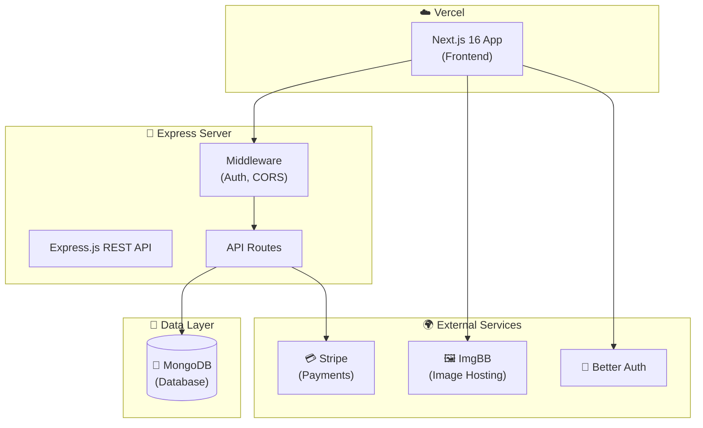

# 🎨 ArtVerse — Full-Stack Art Marketplace Platform

<div align="center">

### 🌐 **[Live Demo](https://art-verse-client.vercel.app/)** &nbsp;|&nbsp; 📦 **[Client Repo](https://github.com/ashiqurrhmn/ArtVerse-Client)** &nbsp;|&nbsp; 🔌 **[Server Repo](https://github.com/ashiqurrhmn/ArtVerse-Server)**

[](https://nextjs.org/)
[](https://react.dev/)
[](https://www.mongodb.com/)
[](https://stripe.com/)
[](https://tailwindcss.com/)

A **production-grade** digital art marketplace with multi-role authentication, secure Stripe payments, distinct artist/buyer/admin dashboards, and a modern, responsive UI.

</div>

---

## 📖 Table of Contents

- [Overview](#-overview)
- [Tech Stack](#-tech-stack)
- [Key Features](#-key-features)
- [Architecture](#-architecture)
- [Getting Started](#-getting-started)
- [Deployment](#-deployment)
- [Author](#-author)

---

## 🎯 Overview

**ArtVerse** is a fully-featured marketplace platform for digital art and creativity, demonstrating modern full-stack development practices. It supports three distinct user roles — **Buyer**, **Artist**, and **Admin** — with complete shopping flows, payment processing, and comprehensive management dashboards.

### Why This Project Stands Out

- ✅ **Full Stripe Integration** — Secure checkout sessions for artwork purchases
- ✅ **Advanced Authentication** — Seamless authentication powered by Better Auth
- ✅ **Multi-role RBAC** — Distinct workflows for Admins, Artists, and Buyers
- ✅ **Optimized Storage** — Image uploads managed securely via ImgBB
- ✅ **Dynamic Dashboards** — Role-specific data visualization and PDF exports (jsPDF)
- ✅ **Production Deployed** — Vercel (frontend) + Express server + MongoDB database

---

## 🔧 Tech Stack

### Frontend
| Technology | Purpose |
|------------|---------|
| **Next.js 16** | App Router, React Server Components |
| **React 19** | UI library with modern concurrent features |
| **Tailwind CSS v4** | Utility-first responsive styling |
| **HeroUI** | Accessible, beautiful UI component library |
| **Better Auth** | Robust authentication system |
| **Framer Motion** | Page transitions and micro-animations |
| **Recharts** | Interactive data visualization for dashboards |
| **jsPDF** | Client-side PDF generation for reports |

### Backend
| Technology | Purpose |
|------------|---------|
| **Node.js + Express.js** | High-performance REST API server |
| **MongoDB** | NoSQL database via native MongoDB driver |
| **Jose** | JWT verification and JWKS parsing |
| **Stripe Node.js SDK** | Payment processing logic |
| **Cors & Dotenv** | Middleware and environment configuration |

---

## ✨ Key Features

### 🔒 Authentication & Authorization
- Seamless login and registration with Better Auth
- Multi-role access control (Buyer, Artist, Admin)
- Secure session management and JWT validation

### 🛒 Shopping Experience
- Artwork catalog with search, categorization, and filtering
- Detailed artwork pages with artist profiles
- Save/favorite functionality for buyers to build their collections
- Fully responsive design with an elegant UI

### 💳 Checkout & Payments
- Stripe Checkout integration for secure transactions
- Verified purchase tracking and automatic artwork status updates (sold/available)
- Purchase limits tied to buyer subscription plans (Free/Pro/Premium)

### 🎨 Dashboards
- **Buyer**: Track purchase history, view saved artworks, and upgrade subscriptions.
- **Artist**: Artwork management (CRUD operations), ImgBB image uploading, and tracked revenue analytics.
- **Admin**: Platform-wide statistics, user management, artwork moderation, transaction oversight, and report generation (PDF).

### 💅 UI/UX & Performance
- Fully responsive across all devices (Mobile, Tablet, Desktop)
- Smooth page transitions and hover effects via Framer Motion
- Glassmorphism and modern design aesthetics

---

## 🏗️ Architecture

### System Design



---

## 🚀 Getting Started

### Prerequisites

- **Node.js** v18+ (v22 recommended)
- **MongoDB** cluster (e.g., MongoDB Atlas)
- **Stripe Account** for payment processing
- **ImgBB API Key** for image uploads

### Quick Start

```bash
# 1. Clone the client repository
git clone https://github.com/ashiqurrhmn/ArtVerse-Client.git
cd ArtVerse-Client

# 2. Install frontend dependencies
npm install

# 3. Set up frontend environment variables
# Create a .env file with NEXT_PUBLIC_BASE_URL, NEXT_PUBLIC_IMGBB_API_KEY, NEXT_PUBLIC_STRIPE_PUBLISHABLE_KEY, etc.

# 4. Clone the server repository (in a separate folder)
git clone https://github.com/ashiqurrhmn/ArtVerse-Server.git
cd ArtVerse-Server

# 5. Install backend dependencies
npm install

# 6. Set up backend environment variables
# Create a .env file with MONGODB_URI, STRIPE_SECRET_KEY, CLIENT_URL, etc.

# 7. Start the backend server
npm start

# 8. Start the frontend development server
cd ../ArtVerse-Client
npm run dev
# Frontend runs on: http://localhost:3000
```

---

## 🌐 Deployment

| Service | Purpose | URL |
|---------|---------|-----|
| **Vercel** | Next.js frontend | [art-verse-client.vercel.app](https://art-verse-client.vercel.app/) |
| **Node Hosting** | Express API server | *(Configured via environment variables)* |
| **MongoDB Atlas** | Database | Cloud-hosted NoSQL database |
| **ImgBB** | Image CDN | Artwork uploads delivery |

---

## 👤 Author

<div align="center">

**Built by [Md. Ashiqur Rahman](https://ashiqur-rahman-portfolio00.netlify.app/)**

[](https://ashiqur-rahman-portfolio00.netlify.app/)
[](https://github.com/ashiqurrhmn)
[](https://www.linkedin.com/in/ashiqur-rahman00/)

</div>

---

<div align="center">

### ⭐ Found this helpful? Give it a star!

**Built with ❤️ using Next.js, Express, and MongoDB**

[](https://github.com/ashiqurrhmn/ArtVerse-Client)
[](https://github.com/ashiqurrhmn/ArtVerse-Server)

</div>
